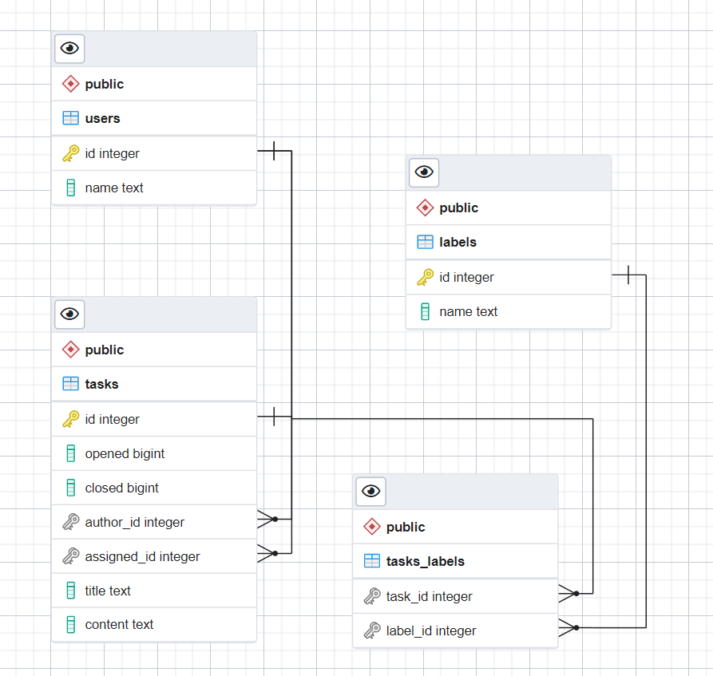

postgres.go - API для работы с БД PostgreSQL.
- вывод списка задач по id и автору;
- создание задачи с возвратом id задачи;
- изменение задачи;
- поиск задачи по метке;
- удаление задачи.

Файл schema.sql для создания стркктуры БД.

ER-диаграмма БД:
